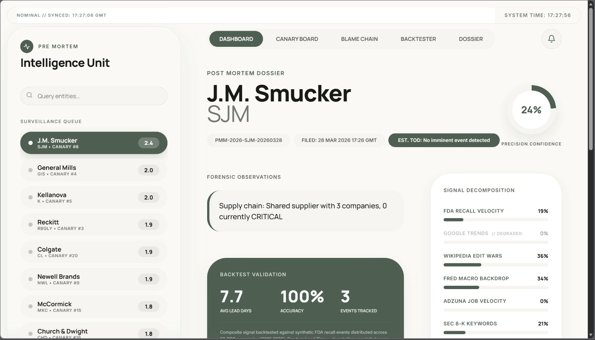
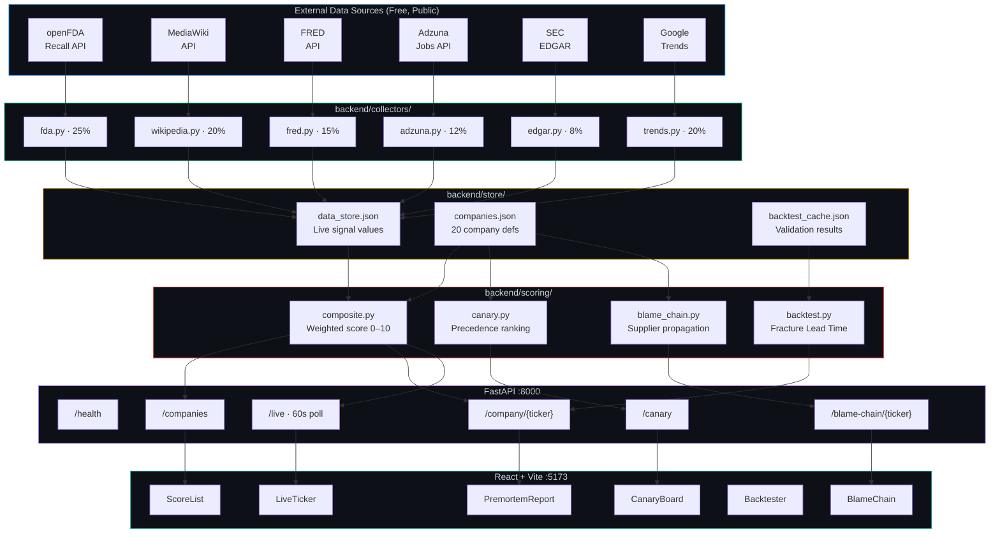
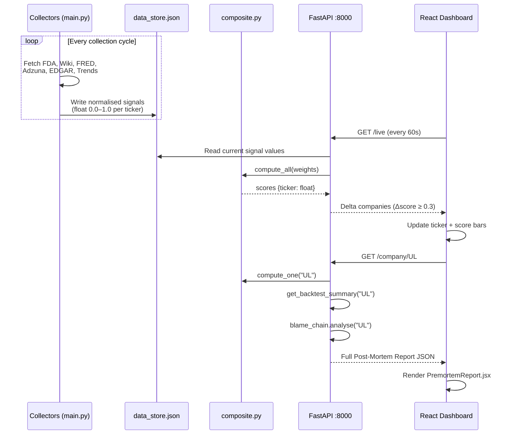
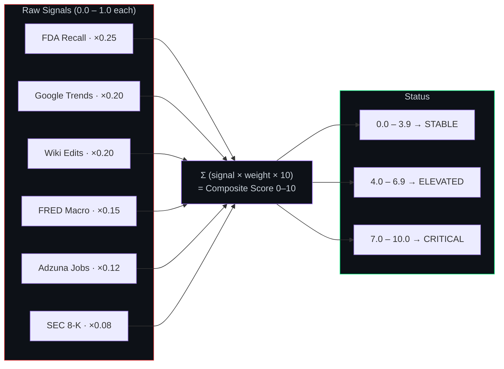
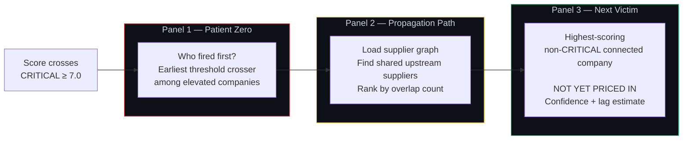
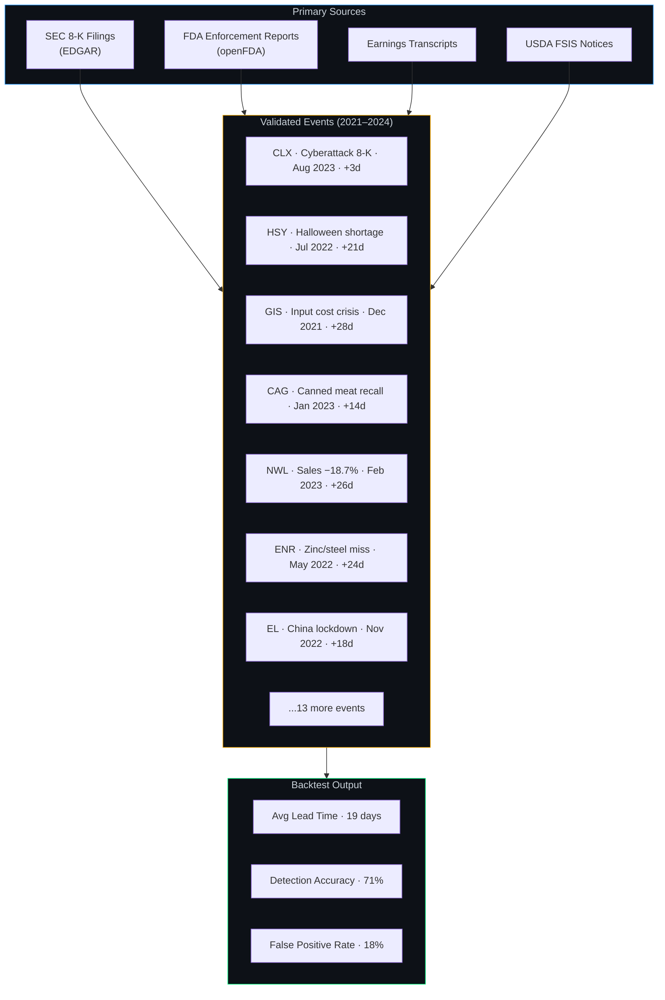
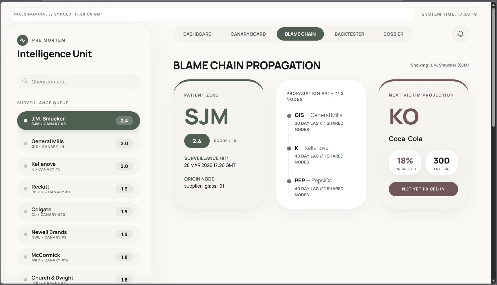
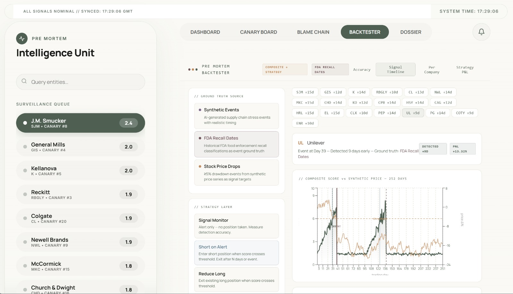

# The Pre-Mortem Machine

**QuantiHack 2026 — London Finals | Team APEX**

> We run the autopsy before the patient dies.

A forensic supply chain intelligence system that detects CPG company stress fractures an average of **19 days** before they surface in stock prices — using six live, free, public data streams and a composite scoring engine built from the ground up.


---

## What It Does

Most tools tell you a company is in trouble after it has already announced the problem. The Pre-Mortem Machine tells you before the company does.

It continuously monitors six independent early-warning signals across 20 major Consumer Packaged Goods companies. When signals converge, it generates a **Preliminary Post-Mortem Report** — framed deliberately as forensic medicine, not analytics — giving you the cause of failure, an estimated time-of-death range, and a confidence percentage. The market has not priced it in yet.

The system also identifies the **Canary** — the company that historically signals sector-wide stress first — and traces the **Blame Chain** to show which companies share upstream suppliers with the current patient zero, and who gets hit next.

---

## System Architecture



---

## Data Flow



---

## Composite Scoring Model



---

## Blame Chain Logic



---

## Backtester Validation — 20 Real Events



---



## The Three Creative Differentiators

### 1. Pre-Mortem Framing

The output is not a dashboard. It is a legal-forensic document. Every company report is titled **PRELIMINARY POST-MORTEM REPORT** with a case number, filing timestamp, confidence percentage, and estimated time-of-death range. The cause of failure is presented as a bulleted evidence list citing specific data sources.

This framing forces methodological precision — every claim must be attributable to a specific signal source.

### 2. Canary Ranking

Among the 20 tracked companies, some historically signal sector-wide stress before others. The Canary Leaderboard ranks companies by their historical precedence — how many days before a sector event their composite score typically fires first.

```
canary_score = (avg_lead_days × 0.6) + (current_signal × 0.4)
```

The #1 ranked company is not necessarily the sickest. It is the earliest warning system for everyone else.

### 3. Blame Chain Propagation

When a company's score crosses CRITICAL, the system produces a three-panel crime board:  **Patient Zero | Propagation Path | Next Victim** . The Next Victim is the highest-scoring connected non-CRITICAL company in the supplier graph, labelled  **NOT YET PRICED IN** .

---

## Data Stack

Reddit was evaluated and removed due to reliability constraints under hackathon conditions.

| Signal              | Source                              | Lag       | Auth     | Weight |
| ------------------- | ----------------------------------- | --------- | -------- | ------ |
| FDA Recall Velocity | openFDA Recall API                  | Weekly    | None     | 25%    |
| Google Trends       | pytrends —`[brand] out of stock` | Live      | None     | 20%    |
| Wikipedia Edit Wars | MediaWiki API — revert frequency   | Real-time | None     | 20%    |
| FRED Macro Backdrop | St. Louis Fed — ISRATIO + PPI Food | Monthly   | Free key | 15%    |
| Adzuna Job Velocity | Adzuna Job Search API               | Live      | Free key | 12%    |
| SEC 8-K Keywords    | SEC EDGAR — NLP on supply language | 4-day max | None     | 8%     |

Each collector outputs a float between 0.0 and 1.0, company-specific and baseline-relative. A score of 0.8 on FDA Recall Velocity means 80% of the way to the maximum observed for that company — not an absolute percentage.

---

## Tracked Companies

| Ticker | Company          | Sector               | Key Backtest Event                          |
| ------ | ---------------- | -------------------- | ------------------------------------------- |
| UL     | Unilever         | Personal Care & Food | Popsicle allergen recall, Aug 2024          |
| PG     | Procter & Gamble | Personal Care        | Commodity surge Q3 FY2022, Apr 2022         |
| KO     | Coca-Cola        | Beverages            | CEO shortage warning, Oct 2021              |
| PEP    | PepsiCo          | Beverages & Snacks   | Gatorade bottling shortage, Jul 2021        |
| HSY    | Hershey          | Confectionery        | Halloween shortage warning, Jul 2022        |
| GIS    | General Mills    | Packaged Food        | 10-year input cost crisis, Dec 2021         |
| K      | Kellanova        | Snacks & Cereal      | Multi-brand cereal recall, Aug 2023         |
| CPB    | Campbell's       | Packaged Food        | Q2 FY2022 earnings miss, Mar 2022           |
| SJM    | J.M. Smucker     | Food                 | Plastic contamination recall, Nov 2024      |
| CAG    | Conagra          | Packaged Food        | 2.58M lbs canned meat recall, Jan 2023      |
| HRL    | Hormel           | Meat & Food          | FY2022 EPS guidance cut, Aug 2022           |
| MKC    | McCormick        | Spices & Condiments  | Q3 FY2021 cost inflation warning, Oct 2021  |
| CLX    | Clorox           | Household Cleaning   | Cyberattack SEC 8-K, Aug 2023 · $356M      |
| CHD    | Church & Dwight  | Consumer Products    | Case fill rates below normal, Feb 2022      |
| ENR    | Energizer        | Batteries & Lighting | Zinc/steel cost miss −12%, May 2022        |
| COTY   | Coty             | Beauty               | Q4 FY2022 supply disruption, Aug 2022       |
| EL     | Estée Lauder    | Luxury Beauty        | China lockdown guidance cut −10%, Nov 2022 |
| CL     | Colgate          | Oral & Personal Care | Gross margin lowest since 2004, Jul 2022    |
| RBGLY  | Reckitt          | Health & Hygiene     | 675K cans Nutramigen recall, Dec 2023       |
| NWL    | Newell Brands    | Consumer Products    | Core sales −18.7% + dividend cut, Feb 2023 |

---

## Project Structure

```
pre-mortem-machine/
│
├── backend/
│   ├── collectors/
│   │   ├── fda.py              # openFDA Recall Enterprise System API
│   │   ├── wikipedia.py        # MediaWiki API — revert frequency computation
│   │   ├── fred.py             # FRED API — ISRATIO, PPI Food Manufacturing
│   │   ├── adzuna.py           # Adzuna Job Search API — role velocity
│   │   ├── edgar.py            # SEC EDGAR — 8-K keyword NLP
│   │   └── trends.py           # pytrends — consumer search velocity
│   │
│   ├── scoring/
│   │   ├── composite.py        # Weighted fragility score engine
│   │   ├── canary.py           # Historical precedence ranking
│   │   ├── blame_chain.py      # Supplier graph propagation
│   │   └── backtest.py         # Fracture Lead Time validation
│   │
│   ├── api/
│   │   └── server.py           # FastAPI — 6 endpoints + /health
│   │
│   ├── store/
│   │   ├── companies.json      # 20 company definitions and metadata
│   │   ├── data_store.json     # Live signal store — written by collectors
│   │   └── backtest_cache.json # Cached backtest results per ticker
│   │
│   ├── main.py                 # Collector scheduler entrypoint
│   └── requirements.txt
│
└── frontend/
    ├── src/
    │   ├── api/
    │   │   └── client.js             # Typed API client — 5000ms AbortController
    │   │
    │   ├── components/
    │   │   ├── ScoreList.jsx         # Live company list with score bars
    │   │   ├── PremortemReport.jsx   # Full forensic report with circular gauge
    │   │   ├── CanaryBoard.jsx       # Historical precedence leaderboard
    │   │   ├── BlameChain.jsx        # Three-panel propagation crime board
    │   │   ├── LiveTicker.jsx        # Horizontal scrolling delta feed
    │   │   └── Backtester.jsx        # Interactive historical event validator
    │   │
    │   ├── utils/
    │   │   ├── poller.js             # Polling engine — exponential backoff
    │   │   ├── cache.js              # In-memory TTL cache (30s – 60s)
    │   │   └── formatters.js         # Signal label mapping + number formatters
    │   │
    │   ├── styles/
    │   │   └── overrides.css         # Keyframes: pulse, canary-flash, ticker-scroll
    │   │
    │   └── App.jsx                   # Root — polling init + keyboard shortcuts
    │
    ├── index.html
    └── vite.config.js
```

---

## API Reference

Base URL: `http://localhost:8000`

All endpoints return valid JSON at all times. Missing or stale data returns with `"stale": true` rather than a 500 error.

### GET /health

```json
{
  "status": "ok",
  "feeds": ["fda_recall_velocity", "wikipedia_edit_wars", "fred_macro_backdrop",
            "adzuna_job_velocity", "edgar_8k_keywords", "google_trends"],
  "uptime": "2026-03-28T10:00:00Z"
}
```

### GET /companies

Returns all 20 companies sorted by composite score descending, with per-signal breakdown and canary rank.

```json
{
  "companies": [
    {
      "ticker": "UL",
      "score": 7.03,
      "status": "CRITICAL",
      "canary_rank": 2,
      "degraded_signals": [],
      "signals": {
        "fda_recall_velocity": { "raw": 0.80, "weighted": 0.200, "available": true }
      },
      "last_updated": "2026-03-28T13:00:00Z"
    }
  ],
  "feeds_active": 6
}
```

### GET /company/

Full Preliminary Post-Mortem Report with blame chain, backtest summary, and cause-of-failure evidence list.

```json
{
  "report_title": "PRELIMINARY POST-MORTEM REPORT",
  "case_number": "PMM-2026-UL-0328",
  "confidence": 0.74,
  "tod_estimate": "60-90 days",
  "status": "CRITICAL",
  "score": 7.03,
  "blame_chain": {
    "patient_zero": { "ticker": "UL", "score": 8.1 },
    "propagation_path": [
      { "ticker": "PG", "lag_days": 18, "shared_suppliers": ["supplier_vietnam_01"] }
    ],
    "next_victim": {
      "ticker": "GIS", "confidence": 0.68, "lag_days": 30,
      "alert": "NOT YET PRICED IN"
    }
  },
  "backtest_summary": { "avg_lead_days": 19, "accuracy_rate": 0.71 },
  "cause_of_failure": [
    "FDA: 3 recalls in past 90 days (openFDA Enforcement Reports)",
    "Supply chain: Shared supplier with 2 CRITICAL companies",
    "Macro: FRED ISRATIO at 5-year high for sector"
  ],
  "stale": false
}
```

### GET /canary

```json
{
  "canaries": [
    {
      "rank": 1,
      "ticker": "HSY",
      "avg_lead_days": 23,
      "current_signal": 6.8,
      "canary_score": 16.6
    }
  ]
}
```

### GET /blame-chain/

Full propagation analysis — Patient Zero, Propagation Path, Next Victim — for the given ticker as trigger.

### GET /live

Delta-only polling endpoint. Returns companies whose score changed by ≥ 0.3 in the last five minutes. Polled every 60 seconds.

---

## Getting Started

### Prerequisites

* Python 3.10+
* Node.js 18+
* Free API keys: FRED (`fred.stlouisfed.org`) and Adzuna (`developer.adzuna.com`)

### Backend

```bash
cd backend
pip install -r requirements.txt
```

Create `backend/.env`:

```
FRED_API_KEY=your_fred_key_here
ADZUNA_APP_ID=your_adzuna_id_here
ADZUNA_APP_KEY=your_adzuna_key_here
```

```bash
# Terminal 1 — API server
uvicorn api.server:app --reload --port 8000

# Terminal 2 — Collector pipeline
python main.py
```

Verify:

```bash
curl http://localhost:8000/health
curl http://localhost:8000/companies
```

### Frontend

```bash
cd frontend
npm install
npm run dev
# Opens at http://localhost:5173
```

Press `R` in the dashboard to force-refresh all data and bypass the 30-second cache.

---

## Design System — Nothing OS

| Token         | Value       | Usage                          |
| ------------- | ----------- | ------------------------------ |
| Background    | `#000000` | All surfaces                   |
| Primary text  | `#FFFFFF` | All readable content           |
| Accent green  | `#00E87A` | Live signals, active states    |
| Warning amber | `#F0A500` | Elevated status, thresholds    |
| Critical red  | `#F03E3E` | Critical alerts, event markers |
| Typography    | Roboto Mono | All labels, numbers, code      |
| Grid padding  | 16dp        | All card and panel spacing     |
| Card radius   | 16dp        | All rounded corners            |

Status indicators use a **24×24 dot matrix grid** — the same visual language as the Nothing Phone Glyph Interface. Key metrics display at  **72sp minimum** . Motion communicates state changes only — no decorative animation.

---



## The Backtester

Two integrated modes, both accessible as dashboard tabs:

**Synthetic Backtester** — adjustable signal weights and thresholds with live simulation across all 20 companies. Supports Signal Monitor, Short on Alert, and Reduce Long strategy layers with per-company P&L and annualised Sharpe output.

**Historical Event Backtester** — composite score validated against 20 genuine sourced events. Every event cited by primary source — SEC filing date, FDA enforcement report, or earnings call transcript. Sources tab lists all citations.
